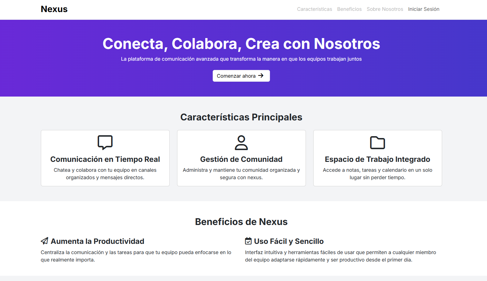
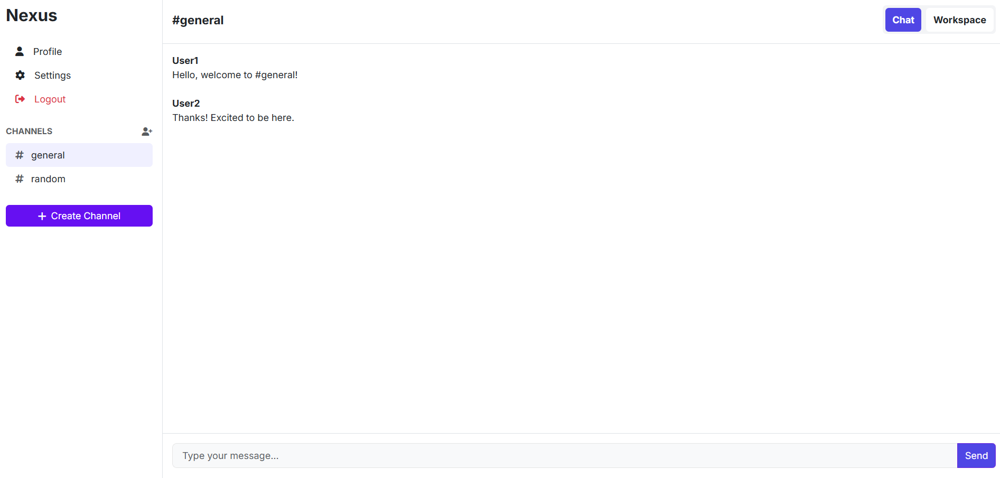
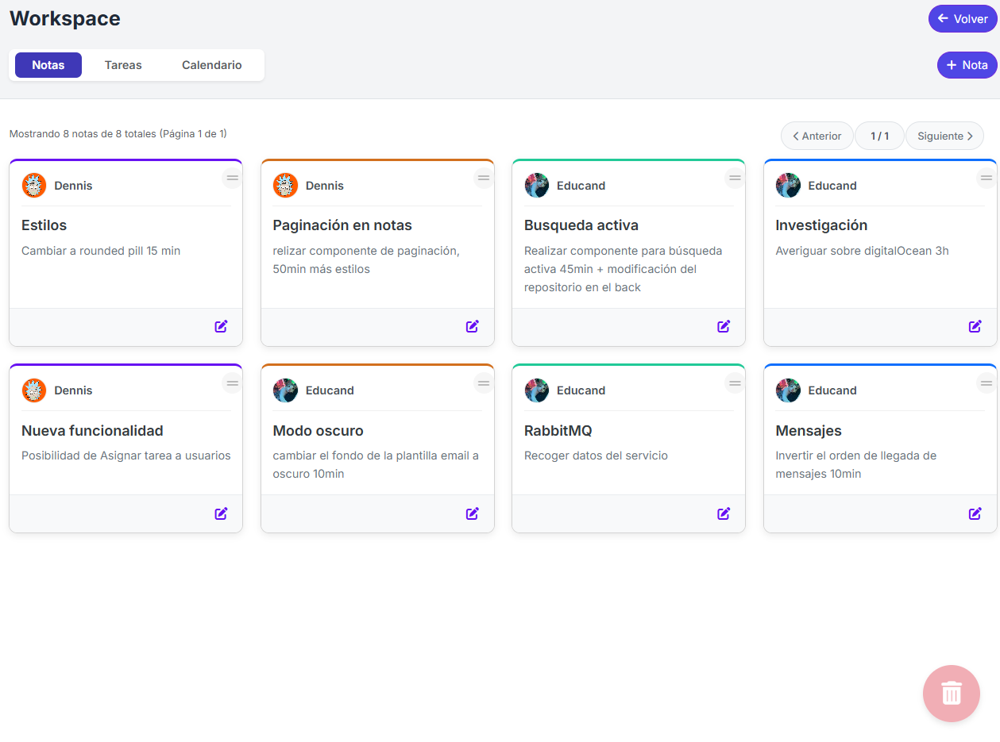
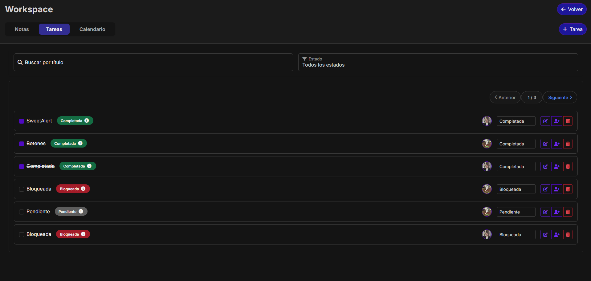
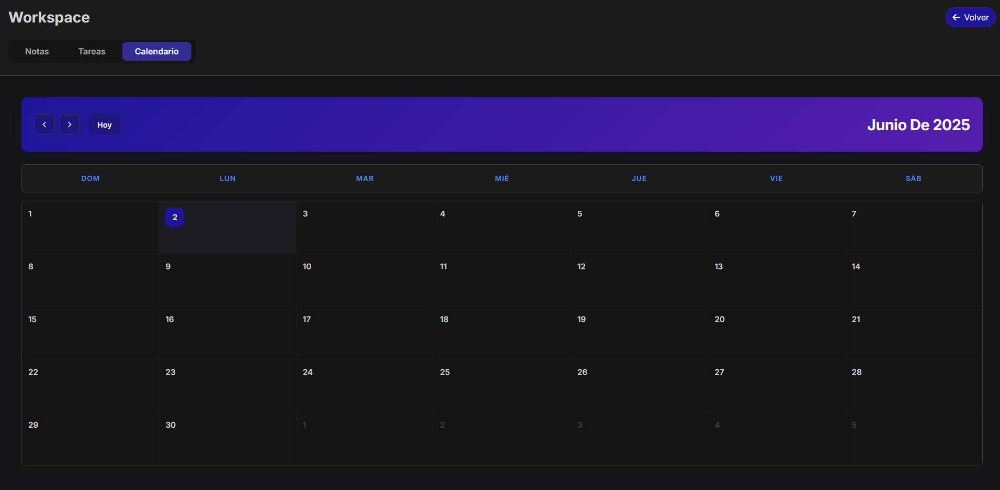
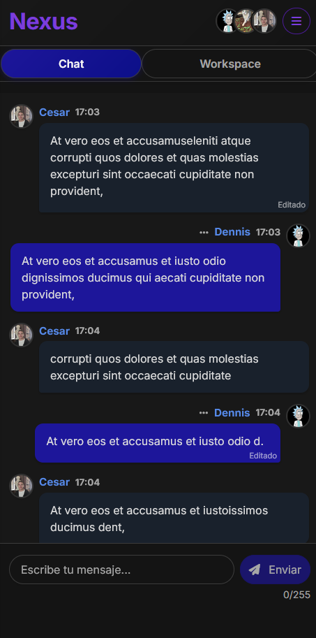

  

# 🚀 Current Projects

### Nexus – Real-Time Collaboration Platform
Full-stack application for team communication and project management. 

**Tech Highlights:** Java + Spring Boot · Angular · WebSockets · RabbitMQ · MySQL

**Core Features:**
- Real-time messaging across channels and servers
- Notes and task management with interactive UI
- User profiles, invitations, and secure authentication (JWT + Spring Security)
- Designed for responsiveness across devices
  
📸 Screenshots available below,

[Nexus_Video](https://drive.google.com/file/d/1QFsRaHY8YvME38d-2GQ7gHev1cM71uuC/view?usp=drive_link)

| Landing | Dashboard | Notes |
|---------|-----------|-------|
|  |  |  |

| Task   | Calendar  | Mobile |
|--------|-----------|--------|
|  |  |  |

## 💡 BrainStorm App [BETA]
Collaborative brainstorming tool with real-time updates. 

**Stack:** Java · Spring Boot · Angular · Tailwind CSS · PostgreSQL

**Note:** The app may take up to 2 minutes to load on first launch due to free server warm-up time. Thanks for your patience.

Check out: https://brainstorm-app.vercel.app

## 🚲 Bicycle Sales Website
Simple landing page for bicycle sales, built with HTML, CSS, and JavaScript.

Check out: https://cgcm070.github.io/

## 

    
    
    
    
    
    
    
    
    
    
    
    
    
    
    
    
    
    
    
    
    
    
    
    
    
    

## 📬 Connect with Me
Linkedin: www.linkedin.com/in/cgcm         
Email: cesar.gabriel.martinezs7@gmail.com

<!---
CGCM070/CGCM070 is a ✨ special ✨ repository because its `README.md` (this file) appears on your GitHub profile.
You can click the Preview link to take a look at your changes.
--->
