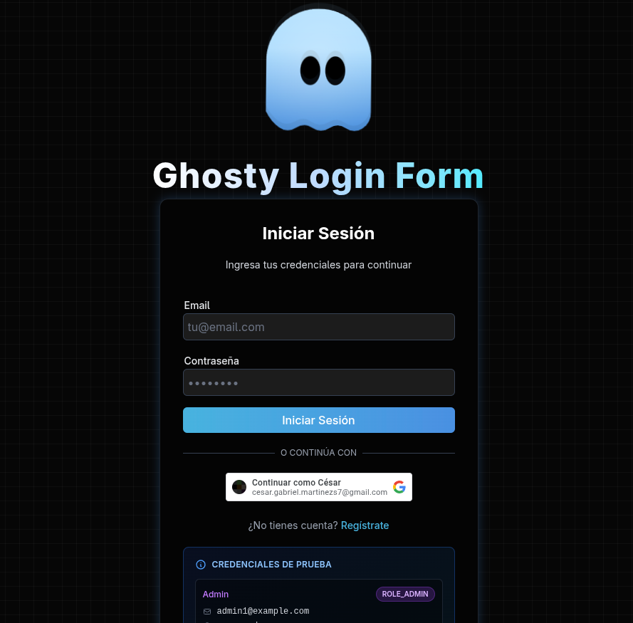
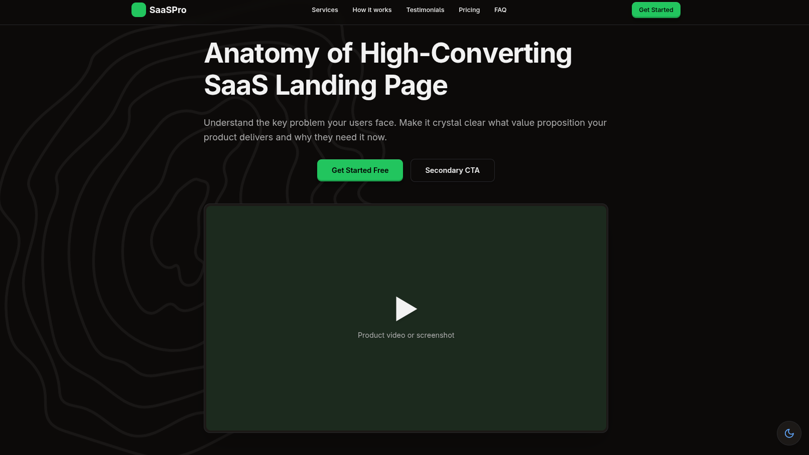

  

 

## 💻 Featured Projects

| Project | Preview |
| :--- | :--- |
| **Nexus – Real-Time Collaboration Platform** Full-stack application for team communication and project management.  _Java · Spring Boot · Angular · WebSockets · RabbitMQ · MySQL_ |  |
| **Brainstorm Collaborative App** Real-time ideas sharing and voting platform. ⚠️ _Note: Initial load may take ~1 min (free tier warm-up)._ [Live Demo](https://brainstorm-app.vercel.app)  _Java · Spring Boot · Angular · Tailwind CSS · PostgreSQL_ |  |
| **GhostyForm** Secure form platform with Google Auth & JWT.  🚀 _Compiled with GraalVM Native Image for instant startup on Render free tier._ ⚠️ _Note: Initial load may take ~1 min (free tier warm-up)._ [Live Demo](https://ghostyform.vercel.app/auth)  _Java Spring Boot · MySQL · Angular · Tailwind CSS_ |  |
| **WhatsApp Audio to Email Tasks** Automation workflow with n8n. 🎧 _Listens for WhatsApp audios via webhook, transcribes them, summarizes tasks, and sends an HTML email report._  _n8n · Webhooks · AI Transcription · HTML Email_ |  |
| **Art Canvas** Digital canvas with AI integration. ✨ _Paint, generate art with Gemini AI, and save as Polaroid._ [Live Demo](https://art-canvas-ruby.vercel.app/)  _Angular · Tailwind CSS · TypeScript_ |  |
| **Bicycle Sales Website** Simple landing page for bicycle sales. [Live Demo](https://cgcm070.github.io/)  _HTML · CSS · JavaScript_ |  |
| **Java Writer** Text editor built with JFrame.  _Java · JFrame_ |  |
| **SaaS Landing Page** Modern landing page for a SaaS. [Live Demo](https://landing-page-snowy-eight-58.vercel.app/)  _Angular · Tailwind CSS · TypeScript_ |  |

    
    
    
    
    
    
    
    
    
    
    
    
    
    
    
    
    
    
    
    
    
    
    
    
    
    

## 📬 Connect with Me

Linkedin: www.linkedin.com/in/cgcm  
Email: cesar.gabriel.martinezs7@gmail.com

<!---
CGCM070/CGCM070 is a ✨ special ✨ repository because its `README.md` (this file) appears on your GitHub profile.
You can click the Preview link to take a look at your changes.
--->
