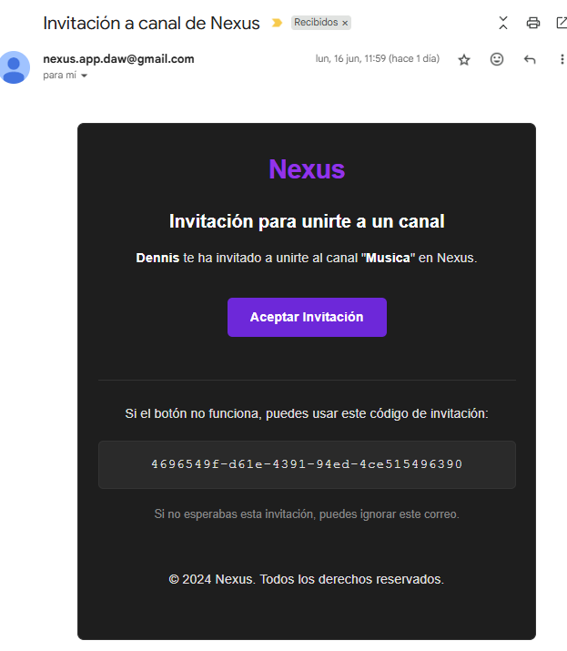

# 👋 Hi, I'm César!
Web Application Developer from IES Vega de Mijas. Committed to continuous personal and professional growth.

## Current Projects

### Real-Time Messaging Application
I am developing Nexus, an advanced real-time communication and collaboration platform. The core of the application uses WebSockets for instant messaging and RabbitMQ for reliable message queuing and distribution. The backend is built with Java and Spring Boot, leveraging its robust ecosystem for enterprise-grade applications.

Key features include:

1. Real-time messaging across multiple channels and servers
2. User authentication and authorization (to be implemented with Spring Security and JWT)
3. A comprehensive notes system with CRUD operations, presented as interactive cards
4. Task management capabilities integrated within communication channels
5. User profile management and customization options
6. Invitation of users via email  

The frontend will be developed using Angular, ensuring a responsive and intuitive user interface across device

The application architecture is designed for scalability, with MySQL as the primary database for persistent storage. The project aims to provide a seamless, all-in-one solution for team communication, project management, and collaboration in the digital workspace."

[Nexus_Video](https://drive.google.com/file/d/1QFsRaHY8YvME38d-2GQ7gHev1cM71uuC/view?usp=drive_link)

| Landing | Dashboard | Notes |
|---------|-----------|-------|
|  |  |  |

| Task   | Calendar  | Mobile |
|--------|-----------|--------|
|  |  |  |

| Email Invitation |
|------------------|
|  |

## BrainStorm App [BETA] 💡

I have created a collaborative brainstorming platform using Java, Spring Boot, Angular, and Tailwind CSS. This project allows me to apply full-stack development knowledge, implementing real-time features with WebSockets and modern web technologies. Work in progress.

**Tech Stack:**
- Backend: Java + Spring Boot + Maven
- Frontend: Angular + TypeScript + Tailwind CSS
- Database: SQL
- Real-time: WebSockets

**Note:** The app may take a moment to load initially as it's hosted on a free server that needs time to start up.

Check out: https://brainstorm-app.vercel.app

### Bicycle Sales Website
I have created a website for selling bicycles using HTML, CSS, and JavaScript. This project has allowed me to apply the knowledge acquired in DAW and refined through the Origamid course. work in progress

Check out: https://cgcm070.github.io/

    
    
    
    
    
    
    
    
    
    
    
    
    
    

## Social Media
Linkedin: www.linkedin.com/in/cgcm         
Email: cesar.gabriel.martinezs7@gmail.com

<!---
CGCM070/CGCM070 is a ✨ special ✨ repository because its `README.md` (this file) appears on your GitHub profile.
You can click the Preview link to take a look at your changes.
--->
